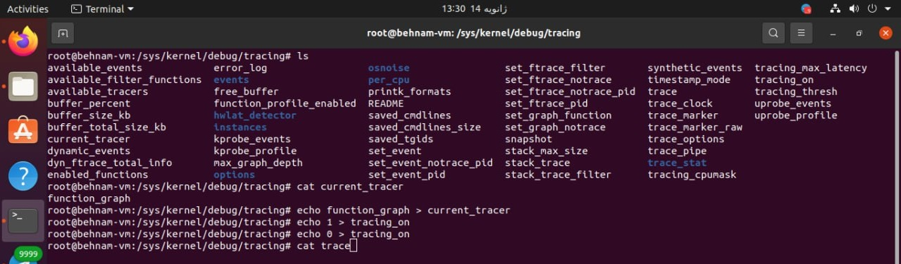
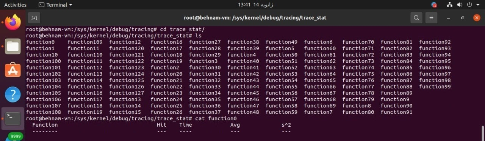
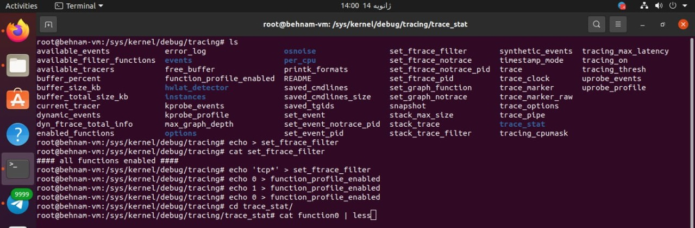

# Function-Tracing-Ftrace


# Function_Tracing

# TCP/IP Protocol Stack Function Trace Analysis

## Overview

This repository contains function trace analysis results obtained using 'Ftrace' during the download of a file. The focus is on capturing functions within the TCP/IP protocol stack, providing insights into the underlying layers involved in the file download process.

## Implementation

### 1. Ftrace Setup

##The function trace was conducted using the 'Ftrace' tool, which captures function calls in the Linux kernel.

In the path below:
```console
cd /sys/kernel/debug/tracing

echo 'tcp*' > set_ftrace_filter
echo function-graph > current_tracer
````
### 2. File Download Scenario

The analysis was performed during the download of a file to observe the function calls related to the TCP/IP protocol stack.
With command `echo 1 > tracing_on`, you can start tracing and then stop tracing with `echo 0 > tracing_on` after downloading a file. and view the output with `cat trace`.
```console
echo 1 > tracing_on
then
echo 0 > tracing_on
then 

cat trace
```



### 3. Function Trace Results

The following functions were observed in the `function_graph` trace, revealing the boundary between layers in the TCP/IP protocol stack. The output below is a part of the trace that we put the complete trace in file `Explain TCP-IP Stack.txt` and you can see the complete output in that file. The boundary of each function and their related explanations as well as the address of that function are also placed the source code of the kernel, which can be referred to the corresponding function in the kernel code.
```console

  1)               |  ip_rcv() {                               # (Network_layer)It performs some initial processing, such as checking the packet's checksum and routing information.
   1)   1.522 us    |    ip_rcv_core();                         # It handles tasks such as fragment reassembly, protocol identification, and delivery to the appropriate application.                                       
   1)               |    ip_rcv_finish_core.constprop.0() {     # ip_input.c line-412
   1)               |      tcp_v4_early_demux() {               # ip_input-line-325-tcp-ipv4-1621-It is responsible for de-muxing TCP packets to the appropriate socket as early as possible in the processing chain. This can improve performance by reducing the amount of processing that needs to be done on packets that are not destined for the local host.
   1)               |        __inet_lookup_established() {      # This function is called from tcp_v4_early_demux() to look up an existing TCP connection. It uses a hash table to quickly find the connection that matches the packet's source and destination addresses and ports.
   1)   0.725 us    |          inet_ehashfn();                  # This function is called from __inet_lookup_established() to calculate the hash value for the TCP connection's key. This hash value is used to index into the hash table.
   1)   2.683 us    |        }
   1)   0.733 us    |        ipv4_dst_check();
   1)   6.367 us    |      }
   1)   8.663 us    |    }
   1)               |    ip_local_deliver() {                   # ip_input line-240 It is responsible for delivering packets to their destination protocol handler. This can involve reassembling IP fragments, calling the appropriate protocol handler, and handling Netfilter hooks.
   1)               |      ip_local_deliver_finish() {          # ip_input line-226 This code  is part of the IP local delivery finish function in the Linux kernel. It is responsible for delivering packets to their destination protocol handler after reassembly and Netfilter processing.
   1)   0.579 us    |        __rcu_read_lock();                 # ip_input line-230 This function is called from ip_local_deliver_finish() to acquire a read lock. The read lock is used to protect the data structures that are accessed during the packet processing from being modified by other threads.
   1)               |        ip_protocol_deliver_rcu() {        # (Transport layer) ip_input line-231-187 The code calls the ip_protocol_deliver_rcu() function to deliver the packet to the appropriate local protocol handler. This function takes the network, the packet, and the protocol number as arguments.also check the policy
   1)               |          raw_local_deliver() {            # raw.c-line-207     line-215-check the policy and ip dont exist the protocol hanler sent the icmp message.
   1)               |            raw_v4_input() {               # raw.c-169 This code snippet is part of the raw_v4_input function in the Linux kernel. It is responsible for delivering packets to raw sockets that match the protocol of the packet.The packet's protocol is not ICMP or the ICMP filter allows the packet. The packet is a multicast packet and the destination address and source address match the socket's filter criteria. The packet was received on the interface associated with the socket.
   1)   0.595 us    |              __rcu_read_lock();
   1)   0.643 us    |              __rcu_read_unlock();
   1)   3.137 us    |            }
   1)   4.339 us    |          }
   1)               |          tcp_v4_rcv() {                   # ip_input line-204 tcp-v4-1808 The INDIRECT_CALL_2() macro will call the function pointed to by ipprot->handler, passing it the arguments tcp_v4_rcv, udp_rcv, and skb. The function that is called will then handle the packet according to its specific protocol.
   1)               |            tcp_inbound_md5_hash() {         This function is called from raw_local_deliver() to handle packets that are destined for TCP connections. It performs further processing of the packet, such as TCP connection management and data delivery.
   1)   0.638 us    |              tcp_parse_md5sig_option();
   1)   2.035 us    |            }
   1)               |            tcp_filter() {                 # tcp-v4-1768 The code filters the packet to see if it should be accepted by the socket. If the packet is not accepted, it is discarded.
   1)               |              sk_filter_trim_cap() {       # This function is called from tcp_filter() to check the packet's length against the socket's buffer size. If the packet is too large, it will be truncated to fit the buffer size.
   1)               |                security_sock_rcv_skb() {  # The additional security filters can be used to enforce specific security policies, such as access control rules.
   1)   0.619 us    |                  apparmor_socket_sock_rcv_skb();
   1)   2.208 us    |                }
   1)   0.607 us    |                __rcu_read_lock();
   1)   0.701 us    |                __rcu_read_unlock();
   1)   6.188 us    |              }
   1)   7.477 us    |            }
   1)   0.675 us    |            tcp_v4_fill_cb();              # tcp-v4-1904 The code fills in the TCP header and data fields of the SKB (socket buffer) with the appropriate information from the packet.
   1)   0.603 us    |            _raw_spin_lock();
   1)               |            tcp_v4_do_rcv() {              # tcp-v4-line-1548 It is responsible for processing incoming TCP packets and delivering them to the appropriate socket.
   1)   0.627 us    |              ipv4_dst_check();            # explained in code
   1)               |              tcp_rcv_established() {      # tcp-input-line-5544
   1)               |                tcp_mstamp_refresh() {     # This function updates the timestamp of the TCP connection. This timestamp is used to calculate the round-trip time (RTT) of the connection.
   1)   1.215 us    |                  ktime_get();
   1)   2.505 us    |                }
   1)               |                __skb_checksum_complete() { # This function calculates the checksum of the packet and verifies that it is correct.
   1)               |                  __skb_checksum() {
   1)   0.931 us    |                    csum_partial();
   1)   2.298 us    |                  }
   1)   3.507 us    |                }
   1)   1.240 us    |                tcp_ack();
   1)   0.623 us    |                tcp_urg();
   1)               |                tcp_data_queue() {         # (Application layer) This function queues the data in the packet for processing by the application.
                                                                  Queues incoming TCP data segments for processing
   1)               |                  sk_forced_mem_schedule() {   # This function schedules memory allocation for the socket.

```

## We can see which functions are called in which of the CPU cores and how many times that function is called.

When you use the following command, network functions are called more often than other functions, and you can identify network functions.

First, run the following command in a terminal :
```console
hping3 -c 30000 -d 120 -S -w 64 -p 80 --flood 127.0.0.1
```
In another terminal, with the following command, you can filter the functions related to the network, which when recording only the functions `tcp`

```console
cd /sys/kernel/debug/tracing

cat set_ftrace_filter

echo 'tcp*' > set_ftrace_filter
```

Now we are ready for function_profile tracing. We start tracking with the following command :

```console
# Start tracing

echo 1 > function_profile_enabled

# Stop tracing

echo 0 > function_profile_enabled
```
### At the following address:
```console

/sys/kernel/debug/tracing/trace_stat
````
We can see the contents of folder `trace_stat` with command `ls`, the output is in the image below. In 'trace_stat' we have some function that show me functions that happended on each core of CPU.



Finally, you can see the output of the performed tracing with the following command:

```console

cat function0 | less > /home/behnam/Desktop/function_profile.txt

```
As you can see in the picture below:




